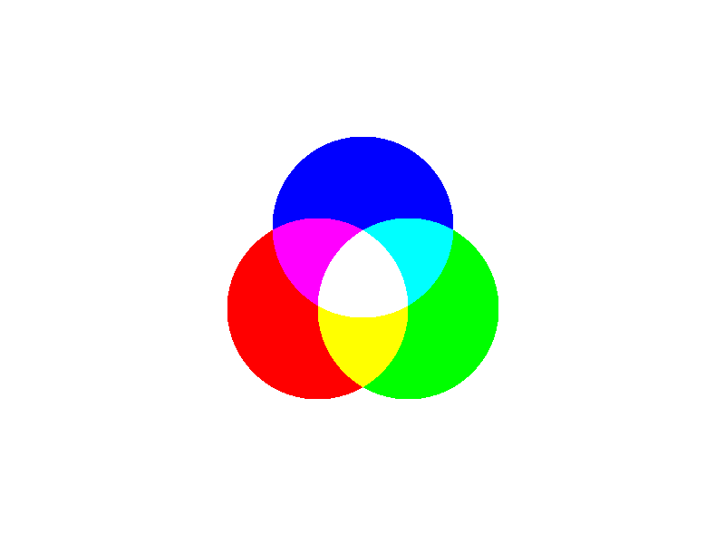
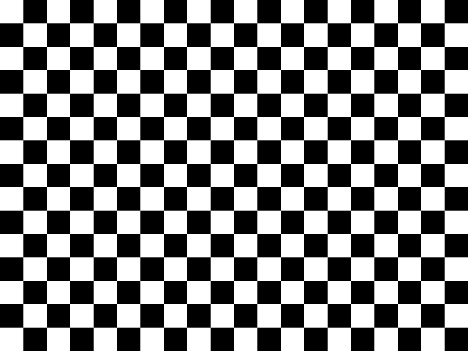

# pygl

Simple graphics library in Python

## Quick Start

```console
$ git clone https://github.com/Andrewsj3/pygl
$ cd pygl
$ python -m pip install -r requirements.txt
$ python example.py 
```

pygl is not on PyPi yet, but for now, you can copy `pygl.py` into your project

## About

pygl is a graphics library that can draw primitive shapes and save them to a png file.
It currently supports RGB, RGBA, and grayscale colour formats, and allows for transparency.

## Images






